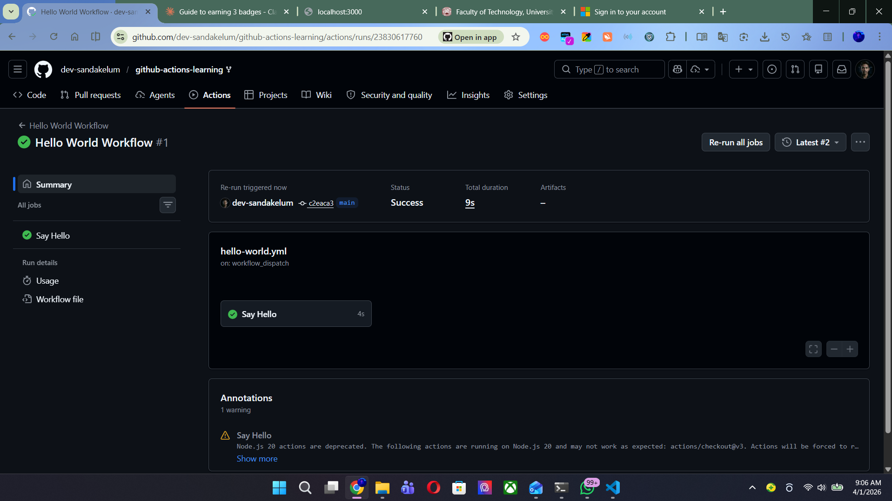
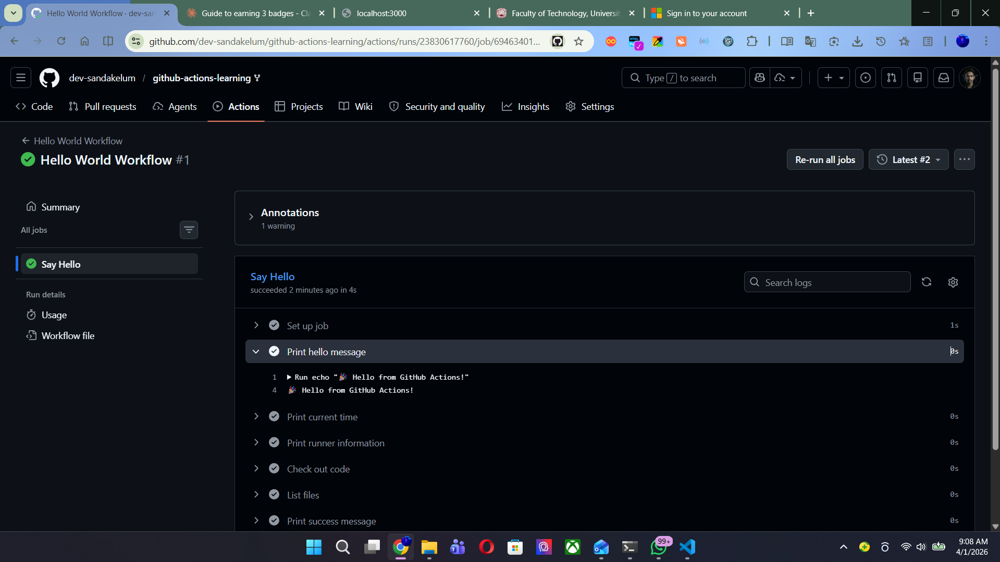
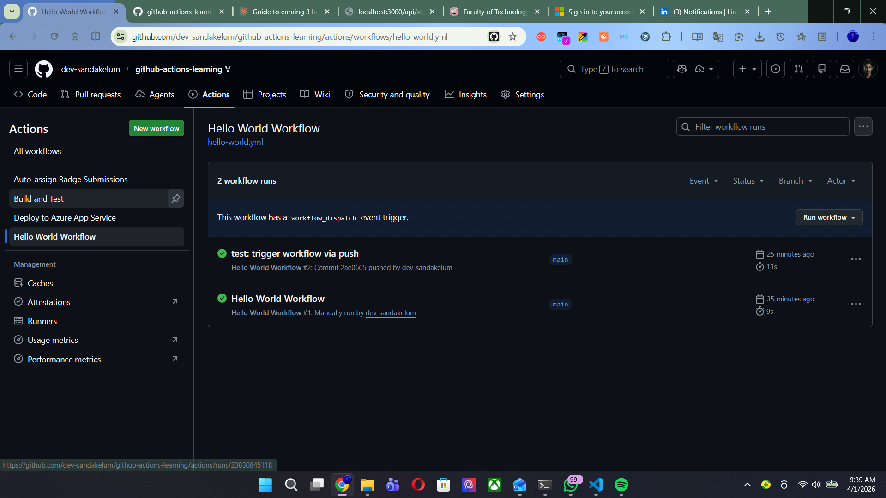
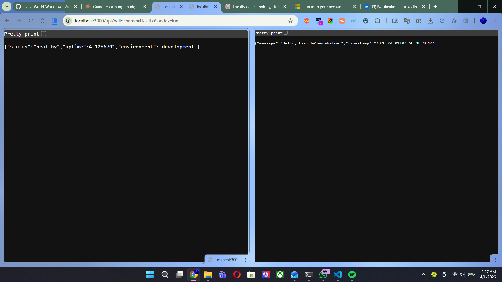

# Beginner Badge Submission - Hasitha Sandakelum

**Date:** April 2026
**GitHub Username:** @YOUR-GITHUB-USERNAME
**Branch:** working-beginner-hasitha
**Status:** Submitted for Review

## Tasks Completed

- [x] Task 1: Run Your First Workflow
- [x] Task 2: Understand Workflow Triggers
- [x] Task 3: Build and Test Locally

## Evidence

### Task 1: Hello World Workflow (Manual Run)

- Went to Actions tab → Hello World Workflow → Run workflow
- Workflow completed successfully with green checkmark
- Verified outputs: Hello message, Runner OS, GitHub SHA, Actor

    

    

### Task 2: Push Trigger

- Added a comment to hello-world.yml
- Committed and pushed to working-beginner-hasitha branch
- Workflow triggered automatically by push event

    

### Task 3: Local Tests Passing

- Ran npm install and npm test inside sample-app/
- All 6 tests passed successfully
- Server started on http://localhost:3000

    

## Notes

Completed all beginner tasks successfully!

---

Submitted & ready for review! ✅
