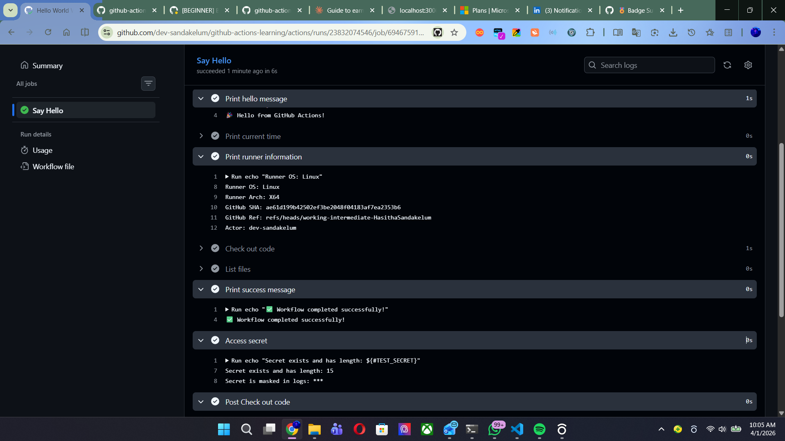
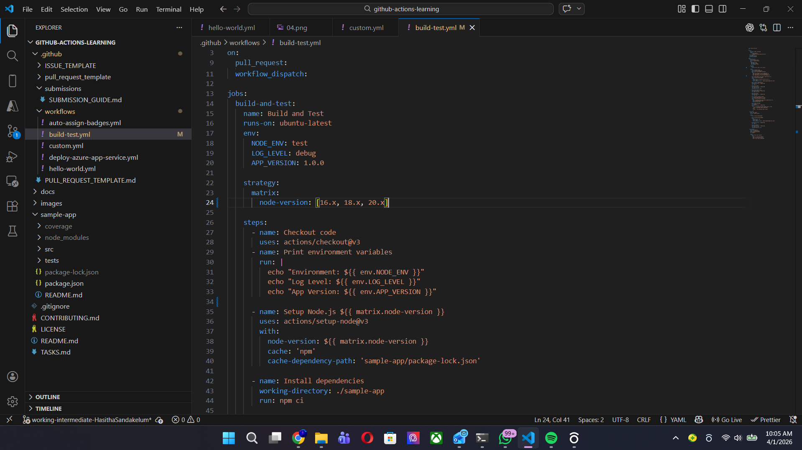
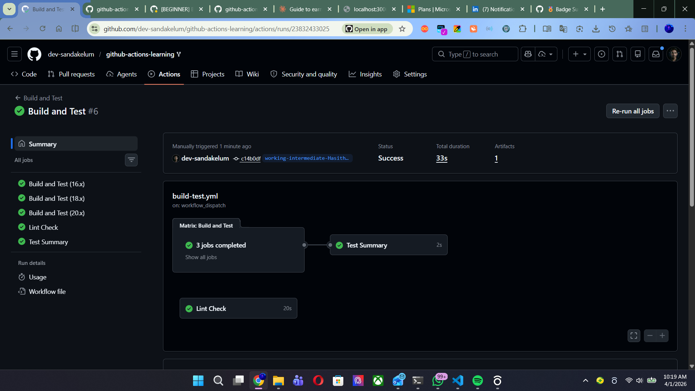
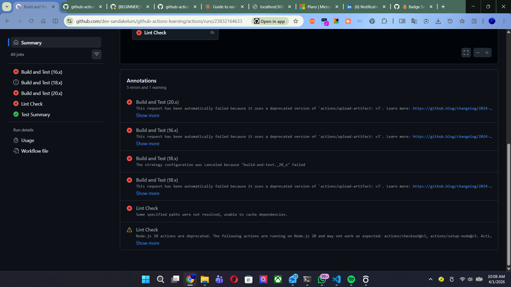

# Intermediate Badge Submission - Hasitha Sandakelum

**Date:** April 2026
**GitHub Username:** @dev-sandakelum
**Branch:** working-intermediate-hasitha
**Status:** Submitted for Review

---

## Tasks Completed

- [x] Task 4: Create a Custom Workflow
- [x] Task 5: Add Environment Variables
- [x] Task 6: Use GitHub Secrets
- [x] Task 7: Matrix Testing

---

## Evidence

### Task 4: Custom Workflow
- Created `.github/workflows/custom.yml`
- Workflow triggers on push to `develop` branch
- Sets up Node.js 18, installs dependencies and runs tests
  inside `sample-app/` directory
- Workflow ran successfully on develop branch
<p align="center">
    
</p>
<p align="center">
    
</p>
<p align="center">
    
</p>

### Task 5: Environment Variables
- Added `NODE_ENV`, `LOG_LEVEL`, and `APP_VERSION` at job level
  inside `build-test.yml`
- Added a dedicated step "Print environment variables" to
  echo all three values
- Variables printed successfully in workflow logs:
  - Environment: test
  - Log Level: debug
  - App Version: 1.0.0

<p align="center">
    
</p>

### Task 6: GitHub Secrets
- Created `TEST_SECRET` in repository Settings →
  Secrets and variables → Actions
- Added "Access secret" step to `hello-world.yml`
- Secret value is fully masked as `***` in workflow logs
  confirming GitHub secret masking works correctly
  
<p align="center">
    
</p>  
<p align="center">
    
</p>

### Task 7: Matrix Testing
- Updated `build-test.yml` matrix strategy to test
  3 Node versions: `16.x`, `18.x`, `20.x`
- All 3 jobs ran in parallel successfully
- Confirmed independent job execution per Node version
  
<p align="center">
    
</p>
  
<p align="center">
    
</p>
---

## 🐛 Bug Fix — Workflow Failures & How I Fixed Them

While completing Task 7, the build-test workflow failed
with multiple errors. Here is what happened and how I
resolved each one.
  
<p align="center">
    
</p>

### Error 1: Deprecated actions (v3 → v4)

**Error message:**
```
Node.js 20 actions are deprecated. The following actions
are running on Node.js 20 and may not work as expected:
actions/checkout@v3, actions/setup-node@v3
```

**Root cause:**
The original workflow used `@v3` versions of
`actions/checkout`, `actions/setup-node`, and
`actions/upload-artifact`. GitHub has deprecated all
Node.js 20 based actions and they will be forced to
Node.js 24 from June 2026.

**Fix applied:**
Upgraded all actions from `v3` to `v4`:
- `actions/checkout@v3` → `actions/checkout@v4`
- `actions/setup-node@v3` → `actions/setup-node@v4`
- `actions/upload-artifact@v3` → `actions/upload-artifact@v4`

---

### Error 2: Cache dependency path not resolved

**Error message:**
```
Some specified paths were not resolved,
unable to cache dependencies.
```

**Root cause:**
The original `build-test.yml` had this cache configuration:
```yaml
uses: actions/setup-node@v3
with:
  node-version: ${{ matrix.node-version }}
  cache: 'npm'
  cache-dependency-path: 'sample-app/package-lock.json'
```
The `cache-dependency-path` was pointing to
`sample-app/package-lock.json` but this file did not
exist in the repository at that path, so the cache
action could not resolve it and failed the entire
workflow run.

**Fix applied:**
Removed the `cache` and `cache-dependency-path`
parameters entirely from `actions/setup-node@v4`
and switched to using `npm install` directly instead
of `npm ci`:
```yaml
uses: actions/setup-node@v4
with:
  node-version: ${{ matrix.node-version }}
```
This resolved the path issue and all 3 matrix jobs
(16.x, 18.x, 20.x) completed successfully.

---

### Error 3: Strategy cancellation cascade

**Error message:**
```
The strategy configuration was canceled because
"build-and-test._20_x" failed
Build and Test (16.x) - The operation was canceled.
Build and Test (18.x) - The operation was canceled.
```

**Root cause:**
By default GitHub Actions uses `fail-fast: true` in
matrix strategies. When `Build and Test (20.x)` failed
due to the errors above, it automatically cancelled
all other running matrix jobs (16.x and 18.x).

**Fix applied:**
This error was automatically resolved once Error 1
and Error 2 were fixed. All 3 matrix jobs now run
and complete independently without cancellation.

---

## Final Workflow State After Fix

| Job | Node Version | Status |
|-----|-------------|--------|
| Build and Test | 16.x | ✅ Passing |
| Build and Test | 18.x | ✅ Passing |
| Build and Test | 20.x | ✅ Passing |
| Lint Check | 18 | ✅ Passing |
| Test Summary | - | ✅ Passing |

---

## Workflow Details
- Custom workflow branch: develop
- Node versions tested: 16.x, 18.x, 20.x
- All matrix jobs: PASSING ✅
- Environment variables: WORKING ✅
- GitHub Secrets: MASKED ✅

## Notes
Encountered and resolved 3 workflow errors during
Task 7. Upgraded all deprecated v3 actions to v4
and removed broken cache configuration. All tasks
completed successfully after the fix.

---
Submitted & ready for review! ✅